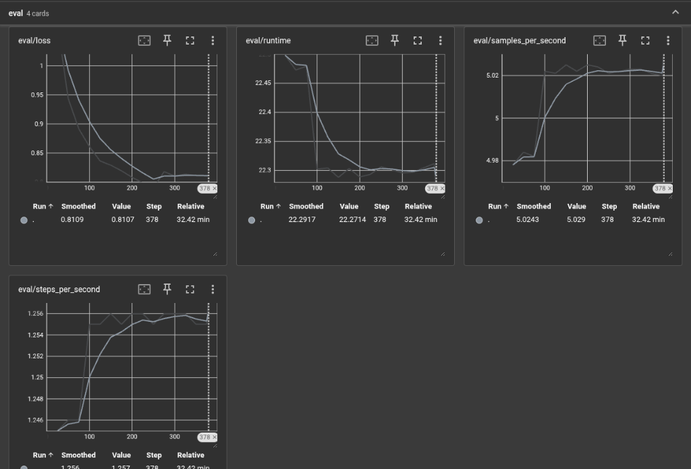

# 🔍 LogSage — AI-Powered Log Incident Analyzer

LogSage is a QLoRA fine-tuned LLM adapter built on **Qwen2.5-7B-Instruct** that analyzes application logs and returns structured JSON incident summaries — identifying the issue, root cause, severity, recommended fix, and confidence score.

## ✨ Features

- **Structured incident analysis** — Returns valid JSON with `issue`, `root_cause`, `severity`, `fix`, and `confidence` keys
- **QLoRA fine-tuned** — 4-bit quantized adapter for efficient GPU inference
- **1,116 curated training samples** — Covering `low`, `medium`, and `high` severity incidents
- **Full observability pipeline** — TensorBoard, metrics JSONL, training curves, and eval outputs

## 📊 Training Results

| Metric | Value |
|---|---|
| Base Model | `unsloth/Qwen2.5-7B-Instruct-bnb-4bit` |
| Method | QLoRA (LoRA r=16, α=16) |
| Dataset | 1,116 rows (1,004 train / 112 eval) |
| Epochs | 3 |
| Total Steps | 378 |
| Final Train Loss | 0.788 |
| Final Eval Loss | 0.811 |
| Best Eval Loss | 0.789 (step 250) |
| Train Runtime | 34.3 min |
| GPU | NVIDIA A10G (AWS EC2 g5.2xlarge) |

### TensorBoard — Evaluation Metrics



### Training Curves


## 🚀 Quick Start

### Prerequisites

- Python 3.10+
- CUDA-capable GPU (for training and inference)

### Installation

```bash
git clone https://github.com/auro-rirum/logsage.git
cd logsage
python -m venv venv
source venv/bin/activate
pip install -r requirements.txt
```

### Inference

```bash
python test_logsage.py \
  --base-model unsloth/Qwen2.5-7B-Instruct-bnb-4bit \
  --adapter-dir LogSage-Qwen2.5-7B-QLoRA-v0
```

Or with custom logs:

```bash
python test_logsage.py --logs "2026-03-21T18:44:55Z ERROR api checkout failed
Error: SASL: SCRAM-SERVER-FINAL-MESSAGE: server signature is missing
DB_HOST=db.internal sslmode=disable
note=RDS instance was switched to require SSL this morning"
```

### Training

```bash
python train_logsage.py \
  --data-path logs_dataset.jsonl \
  --epochs 3 \
  --train-batch-size 2 \
  --gradient-accumulation-steps 4 \
  --learning-rate 2e-4
```

> **Note:** Training requires a CUDA GPU. The original run used an AWS EC2 `g5.2xlarge` instance.

### TensorBoard

```bash
tensorboard --logdir training_tensorboard --port 6006
```

Then open [http://localhost:6006](http://localhost:6006) in your browser.

## 🧠 Prompt Format

LogSage uses the ChatML prompt template:

```text
<|im_start|>system
You are LogSage, a careful incident-analysis assistant. Return only valid JSON with keys: issue, root_cause, severity, fix, confidence.<|im_end|>
<|im_start|>user
Analyze the following logs and identify the issue.

Logs:
<application logs>
<|im_end|>
<|im_start|>assistant
```

### Sample Output

```json
{
  "issue": "Database authentication failed after an SSL policy change.",
  "root_cause": "The application is connecting to PostgreSQL with sslmode=disable while the database now requires SSL.",
  "severity": "high",
  "fix": "Enable SSL in the PostgreSQL connection settings, rotate/retest credentials if needed, and redeploy the service.",
  "confidence": "92%"
}
```

## 📂 Project Structure

```
logsage/
├── train_logsage.py          # Full training pipeline with QLoRA
├── test_logsage.py            # Inference script with adapter loading
├── logsage_data.py            # Data loading, validation, and prompt formatting
├── validate_dataset.py        # Dataset validation utility
├── logs_dataset.jsonl         # Training dataset (1,116 rows)
├── requirements.txt           # Python dependencies
├── training_tensorboard/      # TensorBoard event files
├── training_metrics.jsonl     # Step-by-step metrics stream
├── training_metrics.svg       # Training curves plot
├── training_curves.csv        # Tabular curve export
├── training_summary.json      # Final metrics summary
├── training_eval_outputs.jsonl # Sample eval generations
├── training_train.log         # Full training console log
├── assets/                    # Screenshots and images
│   └── tensorboard_eval.png   # TensorBoard evaluation dashboard
├── TRAINING_RUN_REPORT.md     # Detailed training run report
└── AWS_EC2_RUNBOOK.md         # EC2 deployment runbook
```

## 🔧 Loading the Adapter (Python API)

```python
from peft import PeftModel
from transformers import AutoModelForCausalLM, AutoTokenizer

base_model = "unsloth/Qwen2.5-7B-Instruct-bnb-4bit"
adapter = "auro-rirum/LogSage-Qwen2.5-7B-QLoRA-v0"

tokenizer = AutoTokenizer.from_pretrained(adapter)
model = AutoModelForCausalLM.from_pretrained(base_model, device_map="auto", load_in_4bit=True)
model = PeftModel.from_pretrained(model, adapter)
```

## ⚠️ Limitations

- The dataset is small and curated — outputs should be reviewed by a human before operational use
- This is a **learning-grade** fine-tune, not production validated
- Inference requires a CUDA GPU with at least 16 GB VRAM

## 📄 License

This project is for educational and research purposes.
