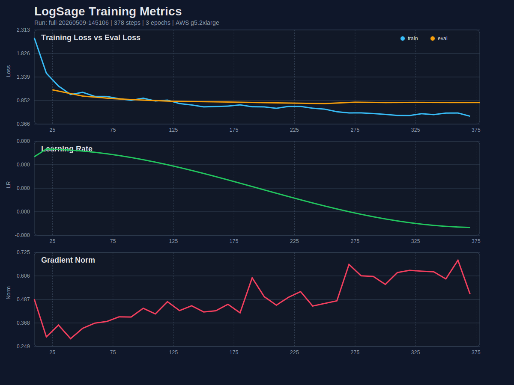

# 🔍 LogSage — AI-Powered Log Incident Analyzer

LogSage is a QLoRA fine-tuned LLM adapter built on **Qwen2.5-7B-Instruct** that analyzes application logs and returns structured JSON incident summaries — identifying the issue, root cause, severity, recommended fix, and confidence score.

> Learning-grade fine-tuning project covering dataset design, QLoRA training, AWS GPU execution, observability, Hugging Face publishing, and adapter inference.

## Project Links

- Hugging Face model: https://huggingface.co/auro-rirum/LogSage-Qwen2.5-7B-QLoRA-v0
- Colab inference notebook: [LogSage_Inference_Colab.ipynb](LogSage_Inference_Colab.ipynb)
- Training report: [docs/TRAINING_RUN_REPORT.md](docs/TRAINING_RUN_REPORT.md)
- AWS runbook: [docs/AWS_EC2_RUNBOOK.md](docs/AWS_EC2_RUNBOOK.md)
- Interview guide: [docs/INTERVIEW_GUIDE.md](docs/INTERVIEW_GUIDE.md)

## ✨ Features

- **Structured incident analysis** — Returns valid JSON with `issue`, `root_cause`, `severity`, `fix`, and `confidence` keys
- **QLoRA fine-tuned** — 4-bit quantized adapter for efficient GPU inference
- **1,116 curated training samples** — Covering `low`, `medium`, and `high` severity incidents
- **Full observability pipeline** — TensorBoard, metrics JSONL, training curves, and eval outputs

## What This Demonstrates

- Built a supervised instruction dataset for log triage with a fixed JSON schema.
- Fine-tuned a 7B instruction model using QLoRA instead of full-parameter training.
- Ran the training workflow on real AWS GPU infrastructure with cost guardrails.
- Logged training/eval metrics, checkpoints, TensorBoard artifacts, and final reports.
- Published the adapter to Hugging Face and documented Colab-based inference.
- Added structured post-processing so raw model text becomes validated JSON.

## Architecture

```text
logs_dataset.jsonl
        |
        v
dataset validation + confidence/severity normalization
        |
        v
ChatML prompt formatting for Qwen2.5-Instruct
        |
        v
QLoRA fine-tuning on AWS g5.2xlarge / NVIDIA A10G
        |
        v
LoRA adapter + tokenizer + metrics + training report
        |
        v
Hugging Face adapter repo + Colab/local inference
        |
        v
JSON extraction + schema validation
```

## Reviewer Snapshot

If you are reviewing this as an internship project, start here:

- [src/train.py](src/train.py) — full QLoRA training pipeline with eval, checkpointing, and reporting.
- [src/data.py](src/data.py) — dataset validation, normalization, and ChatML formatting.
- [src/inference.py](src/inference.py) — adapter inference with JSON extraction and schema validation.
- [docs/TRAINING_RUN_REPORT.md](docs/TRAINING_RUN_REPORT.md) — final metrics and training curve interpretation.
- [LogSage_Inference_Colab.ipynb](LogSage_Inference_Colab.ipynb) — reproducible adapter inference in Colab.

## 📊 Training Results

| Metric | Value |
|---|---|
| Base Model | `unsloth/Qwen2.5-7B-Instruct-bnb-4bit` |
| Method | QLoRA (LoRA r=16, α=16) |
| Dataset | 1,116 rows (1,004 train / 112 eval) |
| Epochs | 3 |
| Total Steps | 378 |
| Final Train Loss | 0.788 |
| Final Eval Loss | 0.811 |
| Best Eval Loss | 0.789 (step 250) |
| Train Runtime | 34.3 min |
| GPU | NVIDIA A10G (AWS EC2 g5.2xlarge) |

### TensorBoard — Evaluation Metrics


### Training Curves



## 🚀 Quick Start

### Prerequisites

- Python 3.10+
- CUDA-capable GPU (for training and inference)

### Installation

```bash
git clone https://github.com/Auro-rium/logsage.git
cd logsage
python -m venv venv
source venv/bin/activate
pip install -r requirements.txt
```

### Inference

```bash
python -m src.inference \
  --base-model unsloth/Qwen2.5-7B-Instruct-bnb-4bit \
  --adapter-dir LogSage-Qwen2.5-7B-QLoRA-v0
```

### Google Colab / PEFT Loading

Notebook in this repo:

- `LogSage_Inference_Colab.ipynb`

Minimal install:

```python
!pip install -U "bitsandbytes>=0.46.1" accelerate peft transformers
```

Basic adapter load:

```python
from peft import PeftModel
from transformers import AutoModelForCausalLM

base_model = AutoModelForCausalLM.from_pretrained("unsloth/Qwen2.5-7B-Instruct-bnb-4bit")
model = PeftModel.from_pretrained(base_model, "auro-rirum/LogSage-Qwen2.5-7B-QLoRA-v0")
```

Recommended 4-bit load:

```python
import torch
from transformers import AutoTokenizer, AutoModelForCausalLM, BitsAndBytesConfig
from peft import PeftModel

base_model_id = "unsloth/Qwen2.5-7B-Instruct-bnb-4bit"
adapter_id = "auro-rirum/LogSage-Qwen2.5-7B-QLoRA-v0"

tokenizer = AutoTokenizer.from_pretrained(base_model_id, trust_remote_code=True)

bnb_config = BitsAndBytesConfig(
    load_in_4bit=True,
    bnb_4bit_quant_type="nf4",
    bnb_4bit_compute_dtype=torch.float16,
    bnb_4bit_use_double_quant=True,
)

base_model = AutoModelForCausalLM.from_pretrained(
    base_model_id,
    quantization_config=bnb_config,
    device_map="auto",
    trust_remote_code=True,
)

model = PeftModel.from_pretrained(
    base_model,
    adapter_id,
)

model.eval()
```

GPU check:

```python
import torch
print(torch.cuda.is_available())
print(torch.cuda.get_device_name(0) if torch.cuda.is_available() else "No GPU")
```

Chat-style inference example:

```python
messages = [
    {
        "role": "system",
        "content": "You are LogSage, a log-analysis assistant. Return only valid JSON with these keys: issue, root_cause, severity, fix, confidence."
    },
    {
        "role": "user",
        "content": """Analyze this log and return only the JSON diagnosis:

{"level": "error", "component": "database", "message": "Connection attempt failed", "details": "psycopg2.connection: host=db.internal port=5432 timeout=10s"}"""
    }
]

prompt = tokenizer.apply_chat_template(
    messages,
    tokenize=False,
    add_generation_prompt=True
)

inputs = tokenizer(prompt, return_tensors="pt").to(model.device)

outputs = model.generate(
    **inputs,
    max_new_tokens=250,
    do_sample=False,
    pad_token_id=tokenizer.eos_token_id
)

generated = outputs[0][inputs["input_ids"].shape[-1]:]
print(tokenizer.decode(generated, skip_special_tokens=True))
```

Or with custom logs:

```bash
python -m src.inference --logs "2026-03-21T18:44:55Z ERROR api checkout failed
Error: SASL: SCRAM-SERVER-FINAL-MESSAGE: server signature is missing
DB_HOST=db.internal sslmode=disable
note=RDS instance was switched to require SSL this morning"
```

### Training

```bash
python -m src.train \
  --data-path data/logs_dataset.jsonl \
  --epochs 3 \
  --train-batch-size 2 \
  --gradient-accumulation-steps 4 \
  --learning-rate 2e-4
```

> **Note:** Training requires a CUDA GPU. The original run used an AWS EC2 `g5.2xlarge` instance.

### Dataset Validation

```bash
python scripts/validate_dataset.py --data-path data/logs_dataset.jsonl
```

### TensorBoard

```bash
tensorboard --logdir results/tensorboard --port 6006
```

Then open [http://localhost:6006](http://localhost:6006) in your browser.

## 🧠 Prompt Format

LogSage uses the ChatML prompt template:

```text
<|im_start|>system
You are LogSage, a careful incident-analysis assistant. Return only valid JSON with keys: issue, root_cause, severity, fix, confidence.<|im_end|>
<|im_start|>user
Analyze the following logs and identify the issue.

Logs:
<application logs>
<|im_end|>
<|im_start|>assistant
```

### Sample Output

```json
{
  "issue": "Database authentication failed after an SSL policy change.",
  "root_cause": "The application is connecting to PostgreSQL with sslmode=disable while the database now requires SSL.",
  "severity": "high",
  "fix": "Enable SSL in the PostgreSQL connection settings, rotate/retest credentials if needed, and redeploy the service.",
  "confidence": "92%"
}
```

## 📂 Project Structure

```
logsage/
├── README.md
├── LogSage_Inference_Colab.ipynb
├── requirements.txt
├── .gitignore
│
├── src/                              # Python source code
│   ├── __init__.py
│   ├── data.py                       # Data loading, validation & prompt formatting
│   ├── train.py                      # Full QLoRA training pipeline
│   └── inference.py                  # Adapter inference script
│
├── scripts/                          # Utility scripts
│   ├── validate_dataset.py           # Dataset validation CLI
│   ├── aws_preflight.sh              # EC2 preflight checks
│   └── ec2_train.sh                  # EC2 training launcher
│
├── data/                             # Datasets
│   └── logs_dataset.jsonl            # 1,116 training rows
│
├── results/                          # Training artifacts
│   ├── training_curves.csv           # Tabular curve export
│   ├── training_metrics.jsonl        # Step-by-step metrics stream
│   ├── training_metrics.svg          # Loss/LR/grad norm plots
│   ├── training_summary.json         # Final metrics summary
│   ├── training_eval_outputs.jsonl   # Sample eval generations
│   ├── training_train.log            # Full console log
│   └── tensorboard/                  # TensorBoard event files
│
├── docs/                             # Documentation
│   ├── TRAINING_RUN_REPORT.md        # Detailed training run report
│   └── AWS_EC2_RUNBOOK.md            # EC2 deployment runbook
│
└── assets/                           # Images
    └── tensorboard_eval.png          # TensorBoard eval dashboard
```

## 🔧 Loading the Adapter (Python API)

```python
from peft import PeftModel
from transformers import AutoModelForCausalLM, AutoTokenizer

base_model = "unsloth/Qwen2.5-7B-Instruct-bnb-4bit"
adapter = "auro-rirum/LogSage-Qwen2.5-7B-QLoRA-v0"

tokenizer = AutoTokenizer.from_pretrained(adapter)
model = AutoModelForCausalLM.from_pretrained(base_model, device_map="auto", load_in_4bit=True)
model = PeftModel.from_pretrained(model, adapter)
```

## ⚠️ Limitations

- The dataset is small and curated — outputs should be reviewed by a human before operational use
- This is a **learning-grade** fine-tune, not production validated
- Inference requires a CUDA GPU with at least 16 GB VRAM

## 📄 License

This project is for educational and research purposes.
